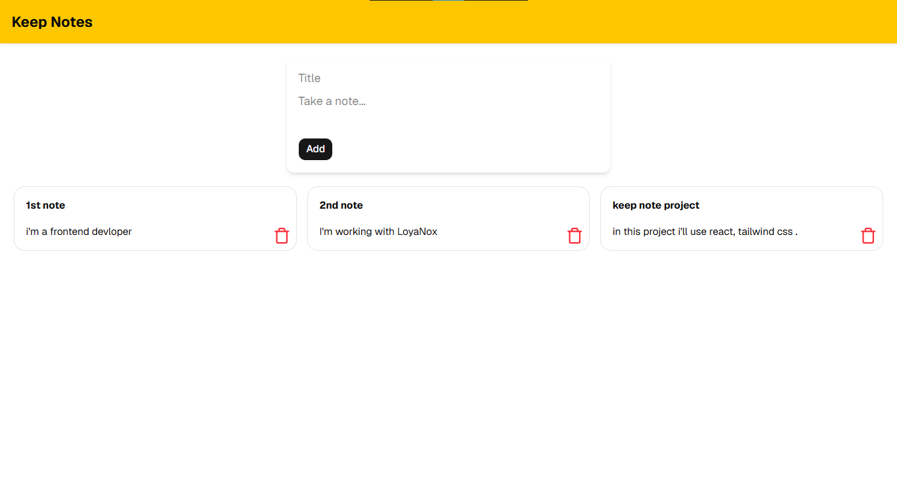

# 📝 Google Keep Clone UI

A simple and responsive **Google Keep Clone UI** built using **React**, **Vite**, **Tailwind CSS**, and **shadcn/ui**.

## ✨ Features

* Google Keep inspired UI
* Notes card layout
* Responsive design
* Clean and modern interface

## 🛠️ Tech Stack

* React
* Vite
* Tailwind CSS
* shadcn/ui
* Lucide React

## 📸 Screenshot





## 🚀 Installation

```bash
git clone https://github.com/your-username/google-keep-clone-ui.git

cd google-keep-clone-ui

npm install

npm run dev
```

## 📁 Project Structure

```text
google-keep-clone-ui/
│
├── public/
│   └── output.png
├── src/
├── package.json
└── README.md
```

## 👩‍💻 Author

**Pranali**

⭐ If you like this project, give it a star on GitHub!
